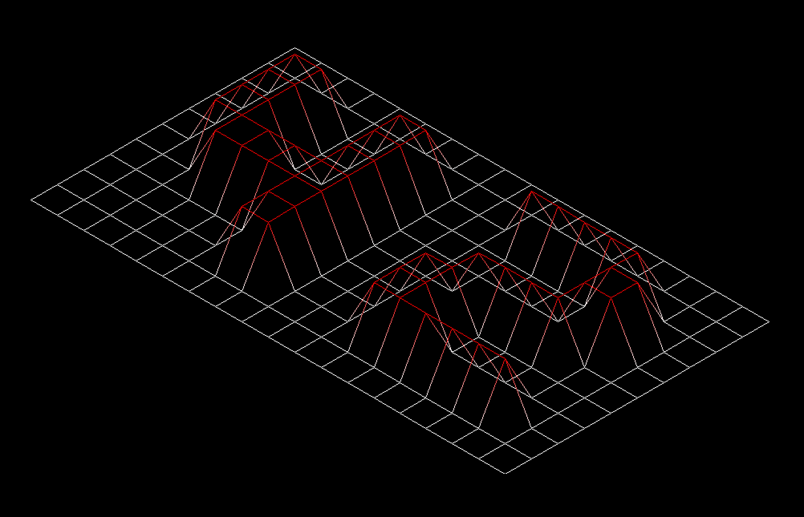

### FdF


- The first graphical project in 42.
- Program that reads a 2D map (example below) and draws a 3D wireframe model (above) of it.
```
0 1 0
0 1 0
0 1 0,0xFF0000
```
- Uses the MLX42 library.
- Controls allow for moving the model, zooming in/out, altering Z (altitude), changing color schemes, and going through projections (isometric, 2d top view, 2d side view, parallel, conic)
