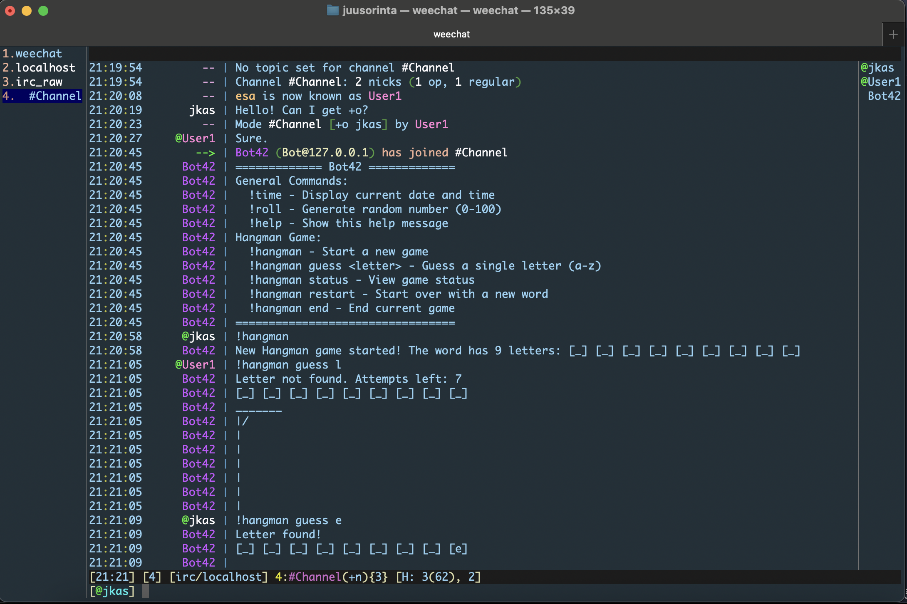

## ft_irc


- A irc-client complient IRC server.
- Supports channel modes;
```
i (invite only)
o (operator)
t (restricted topic)
k (channel key)
l (user limit)
n (external messages)
```
- Supports commands;
```
KICK    INVITE  NAMES
MODE    TOPIC   WHO
PART    PASS    CAP
USER    NICK    QUIT
PING            PONG
PRIVMSG         JOIN
```

### IRC Bot
- `make bonus` creates a ./ircbot executable. The bot joins a specified server as a client, and joins channels upon invitation and/or as specified in the `DEFAULT_CHANNELS` array in `BotConfig.hpp`
- If a channel that is NOT one of the default channels becomes empty, bot parts the channel.
- Supports commands;
```
!time     !roll
!hangman  !help
```
