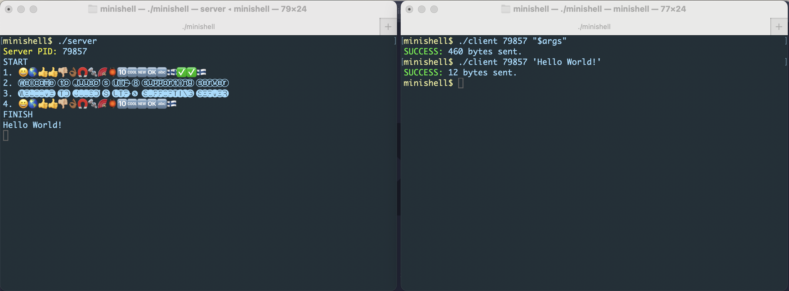

### Minitalk



- Communication between two processes (client and server).
- Usage: run `./server` first, then `./client <server_pid> <message to send>`

```
On macOS, the system reroutes the signal to pid 0 at times,
especially when sending lots of signals in a rapid pace.
A workaround for that is to change line 51 in server.c to;
else if (g_pid != info->si_pid && info->si_pid)

With this, the first signal needs to come from a valid PID,
but once transmission has begun, SIGUSR1/2 signals from the system (0) are allowed as well.
```
